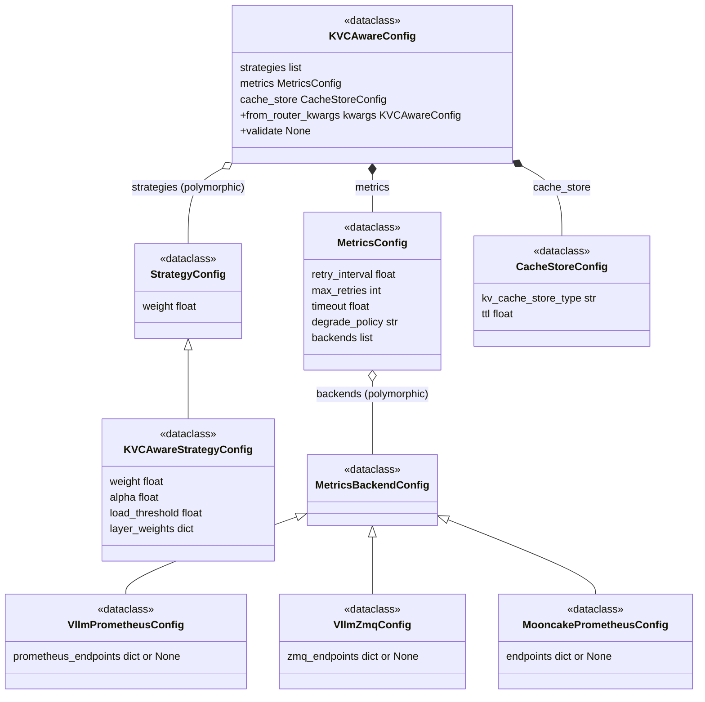

# Config 模块详细设计

> 基于 `overview_arch.md` §4.1 Config 模块，逐模块讨论各模块的配置项与设计决策。

---

## 1 各模块配置总览

LLM Router 共 4 个核心模块 + 1 个辅助模块，配置分两层：

- **VeRL RouterConfig**：VeRL 侧定义，控制 Balancer 选型和 FQN 注册
- **router_kwargs**：传入 Balancer 构造器的 dict，包含各模块的子配置

### 1.1 配置层次

> **来源**：`rollout.router` 的三层结构（`router_strategy` / `router_class` / `router_kwargs`）由 VeRL 定义，参考 `verl-router` commit `cffe7c20`。我们只设计 `router_kwargs` 内部的各模块子配置。

```
VeRL rollout.yaml
  └─ rollout.router (VeRL RouterConfig)
       ├─ router_strategy: "plugin_extension"     ← Balancer 配置
       ├─ router_class: "...KVCAwareBalancer"      ← Balancer 配置（FQN）
       └─ router_kwargs:                           ← 各模块子配置（待设计）
```

---

## 2 router_kwargs 各模块配置项定义

### 2.1 Balancer

Balancer 配置项由 VeRL `RouterConfig` 定义（参考 `verl-router` commit `cffe7c20`），FQN 注册也由 VeRL `_create_plugin_extension` 工厂函数处理。Balancer 本身不需要额外配置字段，`router_kwargs` 内部的子配置见各模块章节。

| 配置层 | 字段 | 类型 | 默认值 | 说明 |
|--------|------|------|--------|------|
| **VeRL RouterConfig** | `router_strategy` | `str` | `"global_sticky_inflight"` | 选择路由策略。使用 KVCAwareBalancer 时设为 `"plugin_extension"` |
| **VeRL RouterConfig** | `router_class` | `str \| None` | `None` | Balancer FQN。`plugin_extension` 模式必填，值为 `"uni_agent.llm_router.balancer.KVCAwareBalancer"` |

### 2.2 Strategy

Strategy 配置通过 `router_kwargs.strategies` 列表传入，每条策略统一为 `(name, weight, kwargs)` 结构。

#### 2.2.1 策略列表结构（所有策略共享）

| 字段 | 类型 | 约束 | 说明 |
|------|------|------|------|
| `name` | `str` | StrategyRegistry 中已注册 | 策略名 |
| `weight` | `float` | 0 < weight ≤ 1，所有策略 Σ ≈ 1.0 | 多策略加权系数。单策略 weight 不影响排名 |
| `kwargs` | `dict` | — | 传给策略构造器的参数 |

#### 2.2.2 KVCAwareStrategy kwargs

| 参数 | 默认值 | 类型 | 说明 |
|------|--------|------|------|
| `alpha` | `0.7` | `float` | cache vs load 内部权重，`S = α × S_cache + (1-α) × S_load` |
| `load_threshold` | `80` | `float` | 过载阈值（百分比），load ≥ threshold → -1 黑名单 |
| `layer_weights` | `{cpu: 1.0, ssd: 0.25}` | `dict[str, float]` | 慢路径层级权重，键固定 cpu/ssd |

> **⚠️ 遗留问题 1**：`load_threshold` 涉及 `gpu_utilization` 和 `queue_depth` 的归一化。`gpu_utilization` vLLM 本身给出百分比（/100 即归一化），但 `queue_depth`（`num_requests_waiting`）是原始整数，归一化需要基准值。是否需要新增 `max_queue_depth` 配置项，或从 vLLM 指标自动获取，待 Metrics 模块设计后再确定。

> **⚠️ 遗留问题 2**：Strategy 是否需要在配置中声明依赖哪些指标（如 `gpu_prefix_hit_rate`、`tier_prefix_hit_rate`、`gpu_utilization`、`queue_depth`），以及 Metrics 模块如何提供「当前可提供哪些指标」的信息，待 Metrics 模块设计后再确定。

### 2.3 Metrics

Metrics 配置通过 `router_kwargs.metrics` 传入，包含跨后端通用配置和后端列表。结构设计与 Strategy 一致：`(type, kwargs)` 列表。

#### 2.3.1 Metrics 通用配置

| 参数 | 默认值 | 类型 | 说明 |
|------|--------|------|------|
| `retry_interval` | `5` | `float` | 断联重试间隔（秒），各后端 kwargs 可覆盖 |
| `max_retries` | `3` | `int` | 最大重试次数，各后端 kwargs 可覆盖 |
| `timeout` | `10` | `float` | 请求超时（秒），各后端 kwargs 可覆盖 |
| `degrade_policy` | `lower_priority` | `str` | 断联重试全部失败后的降级策略：`lower_priority` 降低调度优先级，`exclude` 从可调度队列中去除 |

#### 2.3.2 后端列表结构（所有后端共享）

| 字段 | 类型 | 约束 | 说明 |
|------|------|------|------|
| `type` | `str` | MetricsBackendRegistry 中已注册 | 后端类型名 |
| `kwargs` | `dict` | — | 后端特有构造参数 |

#### 2.3.3 已知后端 kwargs（待各后端详细设计后补充）

| 后端类型 | Collector 类型 | 需要的 kwargs | 说明 |
|----------|---------------|---------------|------|
| `vllm_prometheus` | PollingCollector | `prometheus_endpoints`（可从 server_addresses 自动推断） | 轮询 vLLM `/metrics` |
| `vllm_zmq` | EventCollector | `zmq_endpoints` | ZMQ 订阅 vLLM KV cache block 事件 |
| `mooncake_prometheus` | PollingCollector | `endpoints`（Mooncake master 地址） | 轮询 Mooncake `/metrics` |

> **⚠️ 遗留问题 3**：`degrade_policy` 的具体行为（`lower_priority` 时如何打低分、`exclude` 时如何与 Strategy 黑名单机制衔接）需要在 Metrics 模块详细设计中进一步调研和设计。

> **⚠️ 遗留问题 4**：`vllm_prometheus` 的 `prometheus_endpoints` 从 `server_addresses` 自动推断为 `http://{address}/metrics`，但 `vllm_zmq` 的 `zmq_endpoints` 没有默认推断规则。ZMQ PUB 端口是否需要显式配置，还是可以约定默认端口，待各后端详细设计后确定。

### 2.4 CacheStore

CacheStore 配置通过 `router_kwargs.cache_store` 传入。CacheStore 是被动存储层，写入由各 collector 驱动，对外提供查询接口。

#### 2.4.1 CacheStore 配置项

| 参数 | 默认值 | 类型 | 说明 |
|------|--------|------|------|
| `kv_cache_store_type` | `list` | `str` | KVCacheIndex 存储结构类型，可选 `list` / `radix_tree` 等，不同结构查询效率不同 |
| `ttl` | `30` | `float` | 数据新鲜度阈值（秒），超过此时间的 ReplicaMetrics 视为过期，查询时按 degrade_policy 处理 |

> **⚠️ 遗留问题 5**：`kv_cache_store_type` 的可选值和各类型的具体性能特征，待 Cache 模块详细设计中进一步调研。

---

## 3 Config 数据类类图与解析策略

### 3.1 模块文件结构

> `config.py` 只存放公共基类和通用配置（`ConfigError`、`StrategyConfig`、`MetricsBackendConfig`、`MetricsConfig`、`CacheStoreConfig`、`KVCAwareConfig`），不 import 任何策略/后端特有 config。特有 config 分文件存放，由 `_target_` FQN 在运行时动态解析。
>
> 依赖方向：子模块 → config.py（单向，无循环）。`__init__.py` 从 config.py 和各子模块聚合 re-export。

```
uni_agent/llm_router/
├── config.py                     # 公共基类 + 通用配置 + KVCAwareConfig + from_router_kwargs
├── configs/default.yaml          # 默认 YAML 样例
├── strategies/
│   └── kvc_aware.py              # KVCAwareStrategyConfig → config.py (StrategyConfig)
└── metrics/
│   ├── vllm_prometheus.py        # VllmPrometheusConfig → config.py (MetricsBackendConfig)
│   ├── vllm_zmq.py               # VllmZmqConfig → config.py (MetricsBackendConfig)
│   └── mooncake_prometheus.py    # MooncakePrometheusConfig → config.py (MetricsBackendConfig)
```

### 3.2 解析策略

> `from_router_kwargs()` 分两步解析：(1) 顶层用 `omega_conf_to_dataclass(kwargs, KVCAwareConfig)` 自动解析 dataclass 类型标注的字段（metrics、cache_store）；(2) 遍历 strategies/backends 列表，对每个 `_target_` 条目调用 `hydra.instantiate` 解析为具体 dataclass 实例。
>
> `omega_conf_to_dataclass` 能自动递归解析类型标注为 dataclass 的字段（如 `metrics: MetricsConfig`），但 `list` 内的条目不会自动递归解析（如 `strategies: list`、`backends: list`），需手动遍历逐个 instantiate。
>
> VeRL 把 `router_kwargs` 以 OmegaConf DictConfig 透传给 Balancer，不会帮我们做解析。

### 3.3 数据类类图



#### KVCAwareConfig

| 字段 | 类型 | 合法性约束 | 说明 |
|------|------|------------|------|
| `strategies` | `list[StrategyConfig]` | 非空；Σ weight ≈ 1.0；必填，不可为 null | 策略列表（多态） |
| `metrics` | `MetricsConfig` | 无 | 指标采集配置 |
| `cache_store` | `CacheStoreConfig` | 无 | CacheStore 配置 |

#### StrategyConfig（基类）

| 字段 | 类型 | 合法性约束 | 说明 |
|------|------|------------|------|
| `weight` | `float` | 0 < weight ≤ 1 | 多策略加权系数 |

#### KVCAwareStrategyConfig

| 字段 | 类型 | 合法性约束 | 默认值 | 说明 |
|------|------|------------|--------|------|
| `weight` | `float` | 0 < weight ≤ 1 | — | 继承自 StrategyConfig |
| `alpha` | `float` | 无 | `0.7` | cache vs load 内部权重 |
| `load_threshold` | `float` | > 0 | `80` | 过载阈值（百分比） |
| `layer_weights` | `dict[str, float]` | 键固定 cpu/ssd | `{cpu: 1.0, ssd: 0.25}` | 慢路径层级权重 |

#### MetricsConfig

| 字段 | 类型 | 合法性约束 | 默认值 | 说明 |
|------|------|------------|--------|------|
| `retry_interval` | `float` | > 0 | `5.0` | 断联重试间隔（秒） |
| `max_retries` | `int` | ≥ 0 | `3` | 最大重试次数 |
| `timeout` | `float` | > 0 | `10.0` | 请求超时（秒） |
| `degrade_policy` | `str` | `lower_priority` 或 `exclude` | `"lower_priority"` | 降级策略 |
| `backends` | `list[MetricsBackendConfig]` | 无 | — | 后端列表（多态） |

#### MetricsBackendConfig（基类）

空基类，仅提供类型标识。

#### VllmPrometheusConfig

| 字段 | 类型 | 合法性约束 | 说明 |
|------|------|------------|------|
| `prometheus_endpoints` | `dict[str, str] \| None` | 无；null 时从 server_addresses 自动推断 | vLLM Prometheus endpoints |

#### VllmZmqConfig

| 字段 | 类型 | 合法性约束 | 说明 |
|------|------|------------|------|
| `zmq_endpoints` | `dict[str, str] \| None` | 无 | vLLM ZMQ PUB endpoints |

#### MooncakePrometheusConfig

| 字段 | 类型 | 合法性约束 | 说明 |
|------|------|------------|------|
| `endpoints` | `dict[str, str] \| None` | 无 | Mooncake master endpoints |

#### CacheStoreConfig

| 字段 | 类型 | 合法性约束 | 默认值 | 说明 |
|------|------|------------|--------|------|
| `kv_cache_store_type` | `str` | 已注册的存储类型名 | `"list"` | KVCacheIndex 存储结构类型 |
| `ttl` | `float` | > 0 | `30.0` | 数据新鲜度阈值（秒） |

### 3.4 YAML 配置样例

```yaml
router:
  router_strategy: plugin_extension
  router_class: uni_agent.llm_router.balancer.KVCAwareBalancer
  router_kwargs:
    strategies:
      - _target_: uni_agent.llm_router.strategies.kvc_aware.KVCAwareStrategyConfig
        weight: 1.0
        alpha: 0.7
        load_threshold: 80
        layer_weights:
          cpu: 1.0
          ssd: 0.25
    metrics:
      retry_interval: 5
      max_retries: 3
      timeout: 10
      degrade_policy: lower_priority
      backends:
        - _target_: uni_agent.llm_router.metrics.vllm_prometheus.VllmPrometheusConfig
          prometheus_endpoints: null
        - _target_: uni_agent.llm_router.metrics.vllm_zmq.VllmZmqConfig
          zmq_endpoints: null
        - _target_: uni_agent.llm_router.metrics.mooncake_prometheus.MooncakePrometheusConfig
          endpoints: null
    cache_store:
      kv_cache_store_type: list
      ttl: 30
```

### 3.5 解析结果

```python
KVCAwareConfig(
    strategies=[
        KVCAwareStrategyConfig(weight=1.0, alpha=0.7, load_threshold=80, layer_weights={"cpu": 1.0, "ssd": 0.25})
    ],
    metrics=MetricsConfig(
        retry_interval=5.0, max_retries=3, timeout=10.0, degrade_policy="lower_priority",
        backends=[
            VllmPrometheusConfig(prometheus_endpoints=None),
            VllmZmqConfig(zmq_endpoints=None),
            MooncakePrometheusConfig(endpoints=None),
        ]
    ),
    cache_store=CacheStoreConfig(kv_cache_store_type="list", ttl=30.0)
)
```

---

## 4 测试用例规格

> 每个模块的用例分为五类：①输入输出正常用例；②输入输出异常用例；③Hydra 解析正常用例；④Hydra 解析异常用例；⑤其他用例。
>
> 输入格式为 OmegaConf DictConfig（模拟 VeRL 透传的 `router_kwargs`），strategies/backends 列表中每个条目带 `_target_`。

### 4.1 StrategyConfig / KVCAwareStrategyConfig

#### ① 输入输出正常用例

| ID | 测试场景 | 输入 | 预期结果 |
|----|----------|------|----------|
| S01 | weight = 1.0 | `{"weight": 1.0}` | 正常解析 |
| S02 | weight = 0.7 | `{"weight": 0.7}` | 正常解析 |
| S03 | alpha = 0.7 | `{"alpha": 0.7}` | 正常解析 |
| S04 | alpha = 0.0 | `{"alpha": 0.0}` | cache 权重为 0，纯 load 打分 |
| S05 | alpha = 1.0 | `{"alpha": 1.0}` | load 权重为 0，纯 cache 打分 |
| S06 | alpha 缺失 → 默认值 0.7 | `{}` | alpha = 0.7 |
| S07 | load_threshold = 80 | `{"load_threshold": 80}` | 正常解析 |
| S08 | load_threshold 缺失 → 默认值 80 | `{}` | load_threshold = 80 |
| S09 | layer_weights = {cpu: 1.0, ssd: 0.25} | `{"layer_weights": {"cpu": 1.0, "ssd": 0.25}}` | 正常解析 |
| S10 | layer_weights 缺失 → 默认值 | `{}` | layer_weights = {cpu: 1.0, ssd: 0.25} |
| S11 | 多策略 Σ weight ≈ 1.0 | 两条 weight=0.7+0.3 | 正常解析 |

#### ② 输入输出异常用例

| ID | 测试场景 | 输入 | 预期结果 |
|----|----------|------|----------|
| S12 | weight = 0 | `{"weight": 0}` | ConfigError: weight must be in (0, 1] |
| S13 | weight > 1 | `{"weight": 1.5}` | ConfigError: weight must be in (0, 1] |
| S14 | weight < 0 | `{"weight": -1}` | ConfigError: weight must be in (0, 1] |
| S15 | weight 为字符串 | `{"weight": "0.7"}` | 类型错误 |
| S16 | weight 缺失（必填字段） | `{}` | ConfigError: weight is required |
| S17 | load_threshold = 0 | `{"load_threshold": 0}` | ConfigError: load_threshold must be > 0 |
| S18 | load_threshold < 0 | `{"load_threshold": -1}` | ConfigError: load_threshold must be > 0 |
| S19 | layer_weights 含非 cpu/ssd 键 | `{"layer_weights": {"cpu": 1.0, "disk": 0.5}}` | ConfigError: layer_weights keys must be cpu/ssd only |
| S20 | layer_weights 缺少 cpu 或 ssd | `{"layer_weights": {"cpu": 1.0}}` | ConfigError: layer_weights must contain cpu and ssd |
| S21 | 多策略 Σ weight ≠ 1.0 | 两条 weight=0.4+0.4 | ConfigError: sum of weights must be ~1.0 |
| S22 | strategies 为空列表 | `{"strategies": []}` | ConfigError: strategies 非空 |
| S23 | strategies 不是 list | `{"strategies": "kvc_aware"}` | ConfigError: strategies must be a list |
| S24 | strategy item 不是 dict | `{"strategies": ["kvc_aware"]}` | ConfigError: strategies[i] must be a dict |

#### ③ Hydra 解析正常用例

| ID | 测试场景 | 输入 | 预期结果 |
|----|----------|------|----------|
| S25 | strategy 带 `_target_` instantiate 为 KVCAwareStrategyConfig | `{"_target_": "...KVCAwareStrategyConfig", "weight": 1.0, "alpha": 0.7}` | `type(result) == KVCAwareStrategyConfig` |
| S26 | instantiate 后可通过基类访问 weight | KVCAwareStrategyConfig 实例 | `result.weight == 1.0`，`isinstance(result, StrategyConfig)` |
| S27 | instantiate 默认值填充 | `{"_target_": "...KVCAwareStrategyConfig", "weight": 1.0}` | alpha=0.7, load_threshold=80, layer_weights={cpu:1.0, ssd:0.25} |

#### ④ Hydra 解析异常用例

| ID | 测试场景 | 输入 | 预期结果 |
|----|----------|------|----------|
| S28 | `_target_` FQN 模块不存在 | `{"_target_": "nonexistent.Module.Class"}` | ImportError |
| S29 | `_target_` FQN 类不存在 | `{"_target_": "uni_agent.llm_router.strategies.NonExistClass"}` | AttributeError |
| S30 | `_target_` 缺失 | `{"weight": 1.0}`（无 `_target_`） | instantiate 报错 |
| S31 | `_target_` 指向非 StrategyConfig 子类 | `{"_target_": "...SomeOtherConfig", "weight": 1.0}` | ConfigError: must inherit StrategyConfig |
| S32 | `_target_` 指向非 dataclass | `{"_target_": "...some_function"}` | TypeError |

#### ⑤ 其他用例

| ID | 测试场景 | 输入 | 预期结果 |
|----|----------|------|----------|
| S33 | 空 kwargs → strategies 缺失 | `{}` | ConfigError: strategies is required |
| S34 | strategies 为 null → 缺失 | `{"strategies": None}` | ConfigError: strategies is required |

### 4.2 MetricsConfig / 各 MetricsBackendConfig

#### ① 输入输出正常用例

| ID | 测试场景 | 输入 | 预期结果 |
|----|----------|------|----------|
| M01 | retry_interval = 5.0 | `{"retry_interval": 5.0}` | 正常解析 |
| M02 | retry_interval 缺失 → 默认值 5.0 | `{}` | retry_interval = 5.0 |
| M03 | max_retries = 3 | `{"max_retries": 3}` | 正常解析 |
| M04 | max_retries = 0 | `{"max_retries": 0}` | 正常解析（不重试） |
| M05 | max_retries 缺失 → 默认值 3 | `{}` | max_retries = 3 |
| M06 | timeout = 10.0 | `{"timeout": 10.0}` | 正常解析 |
| M07 | timeout 缺失 → 默认值 10.0 | `{}` | timeout = 10.0 |
| M08 | degrade_policy = lower_priority | `{"degrade_policy": "lower_priority"}` | 正常解析 |
| M09 | degrade_policy = exclude | `{"degrade_policy": "exclude"}` | 正常解析 |
| M10 | degrade_policy 缺失 → 默认值 lower_priority | `{}` | degrade_policy = "lower_priority" |
| M11 | prometheus_endpoints = dict | `{"prometheus_endpoints": {"r0": "http://host/metrics"}}` | 正常解析 |
| M12 | prometheus_endpoints = None | `{"prometheus_endpoints": None}` | 正常解析（自动推断） |
| M13 | zmq_endpoints = dict | `{"zmq_endpoints": {"r0": "tcp://host:5556"}}` | 正常解析 |
| M14 | zmq_endpoints = None | `{"zmq_endpoints": None}` | 正常解析 |
| M15 | endpoints (Mooncake) = dict | `{"endpoints": {"mooncake": "http://host/metrics"}}` | 正常解析 |
| M16 | endpoints (Mooncake) = None | `{"endpoints": None}` | 正常解析 |

#### ② 输入输出异常用例

| ID | 测试场景 | 输入 | 预期结果 |
|----|----------|------|----------|
| M17 | retry_interval = 0 | `{"retry_interval": 0}` | ConfigError: retry_interval must be > 0 |
| M18 | retry_interval < 0 | `{"retry_interval": -1}` | ConfigError: retry_interval must be > 0 |
| M19 | max_retries < 0 | `{"max_retries": -1}` | ConfigError: max_retries must be >= 0 |
| M20 | timeout = 0 | `{"timeout": 0}` | ConfigError: timeout must be > 0 |
| M21 | timeout < 0 | `{"timeout": -1}` | ConfigError: timeout must be > 0 |
| M22 | degrade_policy = random | `{"degrade_policy": "random"}` | ConfigError: must be lower_priority or exclude |
| M23 | metrics 不是 dict | `{"metrics": "vllm"}` | ConfigError: metrics must be a dict |

#### ③ Hydra 解析正常用例

| ID | 测试场景 | 输入 | 预期结果 |
|----|----------|------|----------|
| M24 | backend 带 `_target_` instantiate 为 VllmPrometheusConfig | `{"_target_": "...VllmPrometheusConfig", "prometheus_endpoints": null}` | `type(result) == VllmPrometheusConfig` |
| M25 | backend instantiate 后 isinstance MetricsBackendConfig | VllmPrometheusConfig 实例 | `isinstance(result, MetricsBackendConfig)` |

#### ④ Hydra 解析异常用例

| ID | 测试场景 | 输入 | 预期结果 |
|----|----------|------|----------|
| M26 | backends `_target_` 模块不存在 | `{"_target_": "nonexistent.Module.Class"}` | ImportError |
| M27 | backends `_target_` 指向非 MetricsBackendConfig 子类 | `{"_target_": "...SomeOtherConfig"}` | ConfigError: must inherit MetricsBackendConfig |
| M28 | backends `_target_` 缺失 | `{"prometheus_endpoints": null}`（无 `_target_`） | instantiate 报错 |

#### ⑤ 其他用例

| ID | 测试场景 | 输入 | 预期结果 |
|----|----------|------|----------|
| M29 | 仅 strategies → metrics 默认值 | `{"strategies": [...]}` | retry_interval=5.0, max_retries=3, timeout=10.0, degrade_policy="lower_priority", backends=[] |
| M30 | strategies + metrics 为 null → 默认值 | `{"strategies": [...], "metrics": None}` | MetricsConfig 默认值 |

### 4.3 CacheStoreConfig

#### ① 输入输出正常用例

| ID | 测试场景 | 输入 | 预期结果 |
|----|----------|------|----------|
| C01 | kv_cache_store_type = list | `{"kv_cache_store_type": "list"}` | 正常解析 |
| C02 | kv_cache_store_type = radix_tree | `{"kv_cache_store_type": "radix_tree"}` | 正常解析 |
| C03 | kv_cache_store_type 缺失 → 默认值 list | `{}` | kv_cache_store_type = "list" |
| C04 | ttl = 30.0 | `{"ttl": 30.0}` | 正常解析 |
| C05 | ttl 缺失 → 默认值 30.0 | `{}` | ttl = 30.0 |

#### ② 输入输出异常用例

| ID | 测试场景 | 输入 | 预期结果 |
|----|----------|------|----------|
| C06 | kv_cache_store_type = unknown | `{"kv_cache_store_type": "unknown"}` | ConfigError: unknown store type |
| C07 | ttl = 0 | `{"ttl": 0}` | ConfigError: ttl must be > 0 |
| C08 | ttl < 0 | `{"ttl": -1}` | ConfigError: ttl must be > 0 |
| C09 | cache_store 不是 dict | `{"cache_store": "list"}` | ConfigError: cache_store must be a dict |

#### ③ Hydra 解析正常用例

无。CacheStoreConfig 不含 `_target_`，由 `omega_conf_to_dataclass` 通过 `KVCAwareConfig` 自动递归解析，无需单独 instantiate。

#### ④ Hydra 解析异常用例

无。CacheStoreConfig 结构固定（不含 polymorphic list），不涉及 `_target_` instantiate，无 Hydra 相关异常场景。

#### ⑤ 其他用例

| ID | 测试场景 | 输入 | 预期结果 |
|----|----------|------|----------|
| C10 | 仅 strategies → cache_store 默认值 | `{"strategies": [...]}` | kv_cache_store_type="list", ttl=30.0 |
| C11 | strategies + cache_store 为 null → 默认值 | `{"strategies": [...], "cache_store": None}` | CacheStoreConfig 默认值 |

### 4.4 KVCAwareConfig 顶层

#### ① 输入输出正常用例

| ID | 测试场景 | 输入 | 预期结果 |
|----|----------|------|----------|
| K01 | 完整 kwargs → 正常解析 | 含 strategies + metrics + cache_store 的完整 OmegaConf | 各字段按输入值解析 |

#### ② 输入输出异常用例

| ID | 测试场景 | 输入 | 预期结果 |
|----|----------|------|----------|
| K02 | 多错误聚合 | strategies 空列表 + max_retries=-1 + ttl=0 | ConfigError 包含所有错误信息 |

#### ③ Hydra 解析正常用例

| ID | 测试场景 | 输入 | 预期结果 |
|----|----------|------|----------|
| K03 | 顶层 omega_conf_to_dataclass → KVCAwareConfig | 完整 OmegaConf kwargs | KVCAwareConfig 实例，metrics/cache_store 自动递归解析为 dataclass |
| K04 | metrics 字段自动递归解析为 MetricsConfig | 含 metrics 的 OmegaConf | `type(result.metrics) == MetricsConfig` |
| K05 | cache_store 字段自动递归解析为 CacheStoreConfig | 含 cache_store 的 OmegaConf | `type(result.cache_store) == CacheStoreConfig` |
| K06 | OmegaConf DictConfig 输入 → instantiate 正常 | OmegaConf DictConfig（非普通 dict） | instantiate 成功解析 |

#### ④ Hydra 解析异常用例

| ID | 测试场景 | 输入 | 预期结果 |
|----|----------|------|----------|
| K07 | 顶层含 `_target_` → frozen readonly 冲突 | KVCAwareConfig 为 frozen + YAML 含顶层 `_target_` | ReadonlyConfigError |
| K08 | metrics 含未定义 key | `{"metrics": {"unknown_key": 123}}` | 未知 key 被忽略或报错 |
| K09 | 顶层解析后 strategies[0] 仍为 dict（含 `_target_`） | 完整 kwargs | `type(result.strategies[0]) == dict`，需手动遍历 instantiate |
| K10 | 顶层解析后 backends[0] 仍为 dict（含 `_target_`） | 完整 kwargs | `type(result.metrics.backends[0]) == dict`，需手动遍历 instantiate |

#### ⑤ 其他用例

| ID | 测试场景 | 输入 | 预期结果 |
|----|----------|------|----------|
| K11 | 仅 strategies → metrics/cache_store 默认值 | `{"strategies": [...]}` | metrics 和 cache_store 为默认值 |
| K12 | 手动遍历 instantiate 后 strategies/backends 变为 dataclass | 遍历 strategies/backends 逐个 instantiate | 所有条目为具体 dataclass 实例，继承关系正确 |
|----|----------|------|----------|
| H06 | strategy 带 `_target_` → instantiate 为 KVCAwareStrategyConfig | `{"_target_": "...KVCAwareStrategyConfig", "weight": 1.0, "alpha": 0.7}` | `type(result) == KVCAwareStrategyConfig` |
| H07 | strategy instantiate 后可通过基类访问 weight | KVCAwareStrategyConfig 实例 | `result.weight == 1.0`，`isinstance(result, StrategyConfig)` |
| H08 | strategy instantiate 默认值填充 | `{"_target_": "...KVCAwareStrategyConfig", "weight": 1.0}` | alpha=0.7, load_threshold=80, layer_weights={cpu:1.0, ssd:0.25} |
| H09 | backend 带 `_target_` → instantiate 为 VllmPrometheusConfig | `{"_target_": "...VllmPrometheusConfig", "prometheus_endpoints": null}` | `type(result) == VllmPrometheusConfig` |
| H10 | backend instantiate 后 isinstance MetricsBackendConfig | VllmPrometheusConfig 实例 | `isinstance(result, MetricsBackendConfig)` |
| H11 | OmegaConf DictConfig 输入 → instantiate 正常 | OmegaConf DictConfig（非普通 dict） | instantiate 成功解析 |
| H12 | 普通 dict 输入 → instantiate 需先 OmegaConf.create | `{"_target_": "...KVCAwareStrategyConfig", "weight": 1.0}` | 先转为 OmegaConf 再 instantiate |